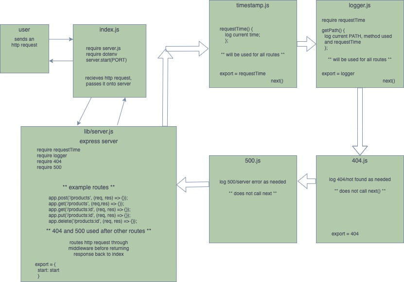

<!---
[ANOTHER README EXAMPLE HERE](https://github.com/codefellows/seattle-javascript-401n17/blob/master/reference/submission-instructions/labs/example/README.md)
--->
# LAB - Class 06

## Project: API Server

### Author: Joe Pennock

### Links and Resources

- [ci/cd](#) - N/A
- [back-end server url](#) - N/A
- [front-end application](#) - N/A
- [Current PR Request](https://github.com/joepennock-401-advanced-javascript/api-server/pull/3)
- [API Swagger Documentation](https://github.com/joepennock-401-advanced-javascript/api-server/blob/master/docs/openapi.json)

### Setup

- Currently no .env variables.

#### `.env` requirements (where applicable)

- Currently no .env variables.

<!---
- `PORT` - Port Number
- `MONGODB_URI` - URL to the running mongo instance/db
-->

#### How to initialize/run your application (where applicable)

- Currently no application exixts.

<!--- #### How to use your library (where applicable) --->

#### Tests

- Currently no tests to run
<!---
- How do you run tests?
- Any tests of note?
- Describe any tests that you did not complete, skipped, etc
--->

#### Collaboration

[Joseph Zabaleta](https://github.com/joseph-zabaleta)
[Diane Stephani](https://github.com/dianestephani)
Ben Hill

#### UML

Initial draft of the project UML. 

